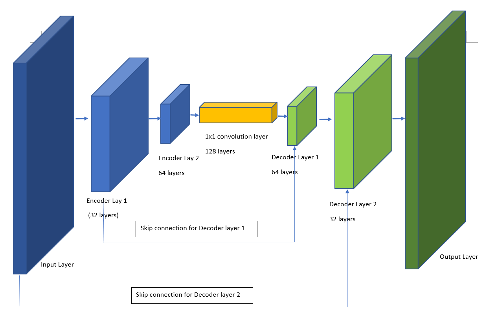

## Project: Follow Me
---
### The write-up conveys the an understanding of the network architecture.

##### The student clearly explains each layer of the network architecture and the role that it plays in the overall network. The student can demonstrate the benefits and/or drawbacks different network architectures pertaining to this project and can justify the current network with factual data. Any choice of configurable parameters should also be explained in the network architecture.

##### The student shall also provide a graph, table, diagram, illustration or figure for the overall network to serve as a reference for the reviewer.

#### Project goal
The goal of this project is to train a neural network to identify a particular person, namely **hero** that is wearing a red shirt with image captured by quad rotor simulation against background and crowd.  The accuracy of the model is measured by IOU (intersection over union), which is the ratio of intersection area between prediction and ground truth, and the union of the two areas.


To achieve this, I utilized a 5 layer Fully Convolutional Network (FCN) (in contrast to Fully *Connected* Network) to preserve the spatial info, since after identifying the hero, we need to have the quad rotor follow the hero around, hence the project name "Follow Me".

My FCN model has the following configuration:

* 2 encoder layer with 32 and 64 filters respectively
  * The encoder layer is used to extract features from the image, and each filter is activated by certain features, e.g. curves or bright spots, and the next layer build on this to form more complex features such as shapes or patterns.
  * Stride of 2 which will result in next layer roughly half the size of input
* 1 1x1 convolution layer
  * 1x1 convolution layer which has 128 filters with filter size and stride both of 1 is used to replace fully connected layer to reserve spatial info.
* 2 decoder layer with 64 and 32 layers respectively, to match the encoder layers
  * Decoder layer upsample smaller input layer using bilinear_up_sample() function to compensate for pooling loss
  * Utilize *skip connection* technique to retain information from previous layer

    

    ```
    ####  ENCODER LAYER ####
    encoder_layer_1 = encoder_block(inputs, filters=32, strides=2)
    encoder_layer_2 = encoder_block(encoder_layer_1, filters=64, strides=2)

    #### 1x1 CONVULUTION LAYER ####
    conv_layer = conv2d_batchnorm(encoder_layer_2, 128, kernel_size=1, strides=1)

    #### DECODER LAYER ####
    decoder_layer_1 = decoder_block(conv_layer, encoder_layer_1, filters=64)
    decoder_layer_2 = decoder_block(decoder_layer_1, inputs, filters=32)

    ```
  *  The choice of relatively simple 5 layer is because we are training on a medium resolution image (256 x 256 pixels for both height and width), adding more layers will add unneeded complexity and increase computation time during training.  Also from sample image the features of the character is relatively simple (compared with real life photos), so this model should be suffix.  However to further improve the score, more layers can be added.


  * Below is output from model.summary()

      ```
      Layer (type)                 Output Shape              Param #   
      =================================================================
      input_5 (InputLayer)         (None, 160, 160, 3)       0         
      _________________________________________________________________
      separable_conv2d_keras_17 (S (None, 80, 80, 32)        155       
      _________________________________________________________________
      batch_normalization_21 (Batc (None, 80, 80, 32)        128       
      _________________________________________________________________
      separable_conv2d_keras_18 (S (None, 40, 40, 64)        2400      
      _________________________________________________________________
      batch_normalization_22 (Batc (None, 40, 40, 64)        256       
      _________________________________________________________________
      conv2d_9 (Conv2D)            (None, 40, 40, 128)       8320      
      _________________________________________________________________
      batch_normalization_23 (Batc (None, 40, 40, 128)       512       
      _________________________________________________________________
      bilinear_up_sampling2d_9 (Bi (None, 80, 80, 128)       0         
      _________________________________________________________________
      concatenate_9 (Concatenate)  (None, 80, 80, 160)       0         
      _________________________________________________________________
      separable_conv2d_keras_19 (S (None, 80, 80, 64)        11744     
      _________________________________________________________________
      batch_normalization_24 (Batc (None, 80, 80, 64)        256       
      _________________________________________________________________
      bilinear_up_sampling2d_10 (B (None, 160, 160, 64)      0         
      _________________________________________________________________
      concatenate_10 (Concatenate) (None, 160, 160, 67)      0         
      _________________________________________________________________
      separable_conv2d_keras_20 (S (None, 160, 160, 32)      2779      
      _________________________________________________________________
      batch_normalization_25 (Batc (None, 160, 160, 32)      128       
      _________________________________________________________________
      conv2d_10 (Conv2D)           (None, 160, 160, 3)       99        
      =================================================================
      Total params: 26,777
      Trainable params: 26,137
      Non-trainable params: 640
      ```


#### The write-up conveys the student's understanding of the parameters chosen for the neural network.

###### The student explains their neural network parameters including the values selected and how these values were obtained (i.e. how was hyper tuning performed? Brute force, etc.) Hyper parameters include, but are not limited to:

* General strategy to come up with optimal setting was to understand the significance of the parameters through their definition, and gradually tune each parameters and observe the change on the network performance through the IOU scores.
* Slack channel and Google are also the main resources I tuned to, so as to leverage experience of other on the values they set and experiment on it.

* The following hyper parameters are set.  
  * learning_rate = 0.002
    * A learning rate of 0.002 is chosen as it is the recommended learning rate for Nadam (Nesterov Adam) optimizer, have tried with lower learning of 0.001 but the improvement is insignificant, so sticking with 0.002 to reduce training time.  
    * In general found that learning rate in magnitude of 1/1000 is optimal
  * num_epochs = 20
    * This is an integer value determining total number of iterations on the data.  With multiple run I found that normally the loss plateaued after certain iteration, and keep on increasing the num_epochs will not help but merely increased training time significantly.
  * batch_size = 32
    * The max batch_size is determined by the hardware (GPU). Since I found it most convenient to train locally on my laptop with a Nvidia GTX 1050 GPU, and 32 is the max batch size before OOM (out of memory) error occur, I have stick with it.
    * Have tried training with bigger batch_size (128) on AWS but it yield lower final score.
  * steps_per_epoch = number_of_training_images // batch_size
    * I set the steps per epoch as number of training image divided by batch size as recommended, it is close to the default value so I have stick with it.
    * In my case it is 140 with additional image added to training data.
  * validation_steps = number_of_validation_images // batch_size
    * I set validation step similar to steps per epoch
    * In my case the value is 46 with additional image added to validation data.
  * workers = 2     
    * Setting workers to 2 as I have a lower end GPU
    *  Have tried setting to much higher value of 32 when trained on AWS, but did not observe significant improvement.

#### The student has a clear understanding and is able to identify the use of various techniques and concepts in network layers indicated by the write-up.

*  Since the final score is calculated by weighting over sum of score while following the target (iou1), and also detection of target from far away (iou3), I have attempted to collect more images of target with settings below for both training and validation.
    ```
    # The IoU for the dataset that never includes the hero is excluded from grading
    final_IoU = (iou1 + iou3)/2
    ```
    
*  The intuition behind is to have the quad rotor hover over a specific area and to have the target walking to zig zag around the same area so that it will capture the target from different angles randomly.

#### Issue faced during training
* Training over GPU vs CPU
  * Initially I followed course lesson and installed CPU version of tensorflow, but found that the training time is very slow (taking hours to train for a shallow network during proto type of the model), I have then decided to switch to GPU version since my laptop has a GTX 1050, which although not a high end GPU, supports latest NVIDIA drivers, CUDA and it's DNN library.  
  * The installation took me almost a day as apparently newest version of CUDA and related cuDNN library is not supported in Window 10 and need to redo some of the steps. Also need to download older version of Visual studio (Visual Studio 2015).  Lastly there was confusion of having to import newly installed "tensorflow-gpu" but turn out that same import command is used for both CPU/GPU version.
  * The effort is definitely worthwhile as >10x speed was observed as soon as GPU training took place, which is important as it allowed me to observe the result of hyper parameters change within an hour or less, rather than having to wait for hours to train.
* Training over AWS
  * Although Udacity provided AWS credit as alternative to train on the cloud, the extra steps of getting limit change approved might take days for the help desk to respond.  Also found that the course note of region selection is ambiguous resulting in having to reapply for limit change.  I have since filed a waffle case so that future students can avoid this pitfall (https://github.com/udacity/robotics-nanodegree-issues/issues/177), which has just been updated as resolved.
  * Also there was worry of using up all the allocated credit due to prolong training session, as even after days of using AWS service, the usage was still not reflected on my account and I have no idea how much credit was consumed.  So I have stick with local training which is much more convenient and worry-free.

### Final result

**present data with highest score, i.e. run 13c and it's loss graph and it's intepretation**
**all other run resuls are archived in "run results" folder**
* [HTML version of notebook](./results/model_training_run_13c_IOU_4453.html)
* [model_weights](./data/weights/model_weights_13c)
* [config_model_weighs](./data/weights/config_model_weights_13c)


### Future improvements
##### The student is able to clearly articulate whether this model and data would work well for following another object (dog, cat, car, etc.) instead of a human and if not, what changes would be required.
* **Need data from each layer to be trained**

### Reference

* Stanford University's popular "CS231n: Convolutional Neural Networks for Visual Recognition" class  http://cs231n.stanford.edu/

* Convolutional Neural Networks by Siraj Raval https://www.youtube.com/watch?v=FTr3n7uBIuE
* A friendly introduction to Convolutional Neural Networks and Image Recognition https://www.youtube.com/watch?v=2-Ol7ZB0MmU&t
* A Beginner's Guide To Understanding Convolutional Neural Networks https://adeshpande3.github.io/adeshpande3.github.io/A-Beginner's-Guide-To-Understanding-Convolutional-Neural-Networks/
* Installing TensorFlow on Windows https://www.tensorflow.org/versions/r1.2/install/install_windows
